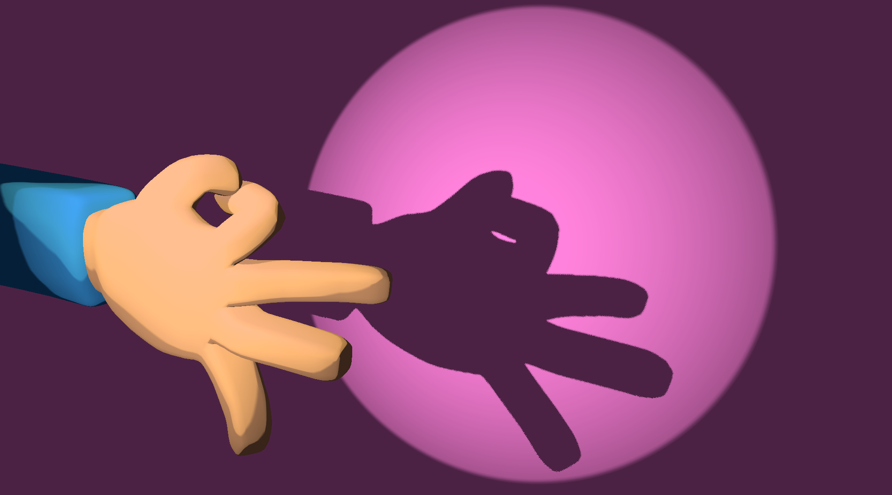

# Nibbler - Devlog - 1

## Contenido
1. [Cuánto arde una idea](#11---cuánto-arde-una-idea)
2. [Las primeras listas](#12-las-primeras-listas)
3. [Ataque al Titán](#13-ataque-al-titán)

---
 

# 1.1. Cuánto arde una idea
Este proyecto arranca desde el choque de dos deseos: armar un juego basado en un teatro de sombras y prototipar un proyecto en el SDK de Playdate (aprender su API, profundizar en Lua, juguetear y hacer juguetes, etc...). El punto de partida no es el cero absoluto, porque ya hay un material base desarrollado en Godot (con Blender detrás), pero sí que es bastante elemental en lo que a Playdate se refiere, asi que será un doble camino de diseño y aprendizaje. Y no es que tenga la mesa libre de cosas pendientes ahora mismo, sino que como viene siendo habitual casi no se ve qué hay debajo de lo acumulado, pero en total entrega a mis tendencias obsesivas, y después de haberme encallado un poco con el prototipo de Godot (sobre todo por aquello de la acumulación de deseos y por cierto *burnout*), la idea de que este posible juego encaja perfectamente con el ecosistema estético de Playdate se prendió muy fuerte y no deja de quemarme por dentro de la cabeza. Tengo la necesidad física, psicológica y emocional de elegir una de las ideas que tengo apuntadas por ahí (modo enajenación, una marea de apps, libretas y postits me entierra cada día), y siento que aquí hay un buen ajuste entre ambiciones, *scope* y, claro está, ilusión: conseguir, en primera instancia, llevar el modelo de la manita a la pantalla de playdate me da calorcito por dentro. Es el puro deseo de construir, de hacer algo con cierta artesanía, lo que arde, con tanta más fuerza cuantos más proyectos desangelados me veo obligado a perseguir por aquello de amasar habilidades en pos de un trabajo, aunque esto es otra historia. La manita, además y por su parte, arrastra tras de sí un montón más de ambiciones, pero aquí nos amarraremos todo lo posible y *simplemente* iremos a por lo esencial, armarnos nuestro pequeño teatro de sombras alimentado a manivela.

Me gustaría aprovechar también para documentar todo el proceso de manera que pueda servir tanto como diario de desarrollo personal como un registro (relativa, aspiracionalmente) útil para cualquier persona que quiera acercarse a desarrollar en Playdate y esté un poco como yo estoy ahora: más perdido que Carracuca. (No sé quién fue ni por qué estaba perdida esta persona). Siempre intento dejar un rastro como este cuando armo algo que tenga que ver con la programación y el desarrollo, aunque dudo haya servido nunca a nadie para nada. *Just in case*, supongo.

Dicho todo esto, y en virtud de aquello de que tengo que ir haciéndome con el SDK de Playdate y entender cómo construir un flujo realista entre Blender y su API (es decir, necesito investigar cómo dibujar en 3D (pequeño adelanto: es todo una ilusión, prestidigitación... un juego de sombras **ja*)), un punto se impone como primer orden de los días: un prototipo inicial con un modelo simple que pueda manejarse con la manivela al otro lado de las herramientas de la consola. Así que toca trazar el primer plan, la primera de muchas listas que le crecerán a este proceso como setas después de una tormenta.

 

 

## 1.2. Las primeras listas
El primer prototipo (de un prototipo, así somos) siempre tiene que ser lo más compacto posible, estar bien atado y enfocarse en servir como campo de pruebas para el flujo de trabajo y el *feel* del juego. En esencia, lo que hace falta es probar lo más atómico de las vibras, los verbos y las variables que luego podrían, de cuajar, definir un prototipo más centrado en armar un miniensayo de una hipótesis de juego. Mucho tanteo de un tanteo de un tanteo, pero hay que economizar medios, mas aún cuando se trata de alguien (yo) que tiende a invertir tiempo y energías a paladas en proyectos que tienen una tasa de cuaje más que inestable (baja, tirando a muy baja). Pero el orden y sus herramientas están de mi lado, así que pongámosles uso.

### Qué es este prototipo
Una pequeña escena interactiva en Playdate consistente en:
- 2 o 3 cubos en diferentes posiciones y perspectivas
- Cada cubo representado por una colección de *sprites* prerrenderizados (esto tiene que ver con el asunto de las 3D en Playdate, luego entraremos en ello en profundidad)
- Un feel de 3D basado en la rotación interactiva
- Un sistema de control que permitaÑ
	- Seleccionar un cubo con la cruceta
	- Rotar el cubo seleccionado usando la manivela (juguetear con los ejes de rotación es un plus)

### Qué no es este prototipo
Diseñar, renderizar y armar un juego como este en Playdate no pinta especialmente sencillo, pero su dificultad parece ir más en la línea de cómo construir la ilusión, la estética y, sobre todo, el *feel* que en lo que era, por su lado en Godot, una complejidad basada en físicas, controladores e iluminación en tiempo real. Todo ello muy interesante, pero enterrado bajo la obsesión de lo Playdate, así que ya lo recuperaré en otro momento (iluso). Total, que lo que no hay que perseguir en este prototipo, y casi que tampoco a la larga, es:
- Un desliegue de físicas y cálculos complejos para controlar las posturas de la mano y su traslación a sombra
- Un manejo de cámeras tridimensionales ni de perspectiva, solo una composición de escena basada en capas y superposiciones (magia, mucha magia)
- Nada que no sea una pura prueba de concepto. Es decir, no pulir como un loco más allá de un prototipo que exprese lo que busca. No ser mi típico yo. Ser otro yo.

### Qué busca responder este prototipo
Un puñadito de preguntas básicas (cualquier expresión en la línea de "es posible...?" no es más que un parapeto para la inquisición real, "soy capaz de...?"):
- **Es la ilusión de la rotación 3D convincente en la pantalla de Playdate?** *(puedo avanzar que sí, porque ya hay juegos increíbles que lo hacen, como [A Fool's Errand](https://play.date/games/a-fools-errand/) y [Diora](https://play.date/games/diora/))*
- **Cuántos sprites hacen falta para que la traslación de un cubo en 3D a la ilusion se sienta bien?** *(o, cuántos pasos de rotación componen el punto justo)*
- **Cómo se siente la rotación y el *snapping* de los sprites al manejarlos con la manivela?** *(buscamos una sensación de juguete, de objeto analógico, de marioneteo)*
- **Cuál es la mejor manera de armar el bucle Blender → sprite → SDK?** *(por esto, en gran parte, empezamos por un cubo y no por la mano a lo loco)*
- **Qué margen de diseño da este bucle para armar cosas en un modelo 3D y luego llevarlo al flujo estético y jugable del prototipo?** *(para esto podríamos introducir alguna otra interacción/transformación al cubo, ya veremos)

Si todo esto cuaja, la mano es automáticamente viable. Y yo creo que cuajará. Confío, tengo fe, me entrego (*se abandona).

### El cómo tras los qués
Construir esto pinta a una de esas cosas que son esencialmente fáciles pero que se van a embarrar por aquello de tener que aprender a manejar un cómo por cada qué (el ratio es a ojo, no lo tomemos como un 1:1 estricto). Así, desde la absoluta distancia que implica un Dia Uno:

- **Diseño** (Blender):
	- Cubo simple
	- Cámara fija (axonométrica, mismo)
	- Shading plano
		- Habrá que ver cómo tirarle al dithering *down the line*, pero en este punto podemos trabajar con escala de grises plana
	- Renderización de pasos de rotación a PNG
- **Ejecución** (SDK-Lua):
	- *Boilerplate* para una escena interactiva (ya hice alguna antes, pero *no me acuerdo*)
	- Conversión de sprites PNG a texturas manejables dentro del motor
	- Codificación de un input polling básico (hay que aprender cómo es la API de la manivela)
- **Iteración**
	- Implementar comportamientos ligeramente diferentes (en lo visual, siempre) para cada cubo
	- Probar, si se tercia, alguna otra forma básica (otra primitiva, o alguna composición algo mas compleja)

 

## 1.3. Ataque al Titán
Checklisteando, que es gerundio, que esto debería ser rápido (y un poco furioso):
- [x] Fase 0 - Decisiones y amarres
	- [x] Ángulo de la cámara: **axonométrica básica**
	- [x] Eje de rotación: **Eje Y (rotación vertical)**
	- [x] Cantidad tentativa de pasos de rotación: **16 sprites**
	- [x] Tamaño de los sprites: **64px**
	- [x] Shading: **Escala de grises plana**

 

- [ ] Fase 1 - Configuración de blender
	- [ ] Montar escena básica con cubo (a partir de las decisiones de la fase 0; luz directa fuerte, *flat shading*, fondo transparente, etc.)
	- [ ] Renderización de sprites
		- [ ] Decidir si los 16 sprites equivalen a `360º` o a `90º` (a efectos visuales, rotar el cubo 90 o 360 grados es igual, pero habrá mucha diferencia visual si los sprites se reparten de una u otra manera)
			- [ ] ¿Probar ambos?
	- [ ] Organizar los sprites secuencialmenteÑ `**cube_00.png**`, `**cube_01.png**`, ...
	- [ ] Investigar cómo trasladar la escala de grises al *dithering* de Playdate

 

- [ ] Fase 2 - Importación de materiales y prueba de sprites
	- [ ] Cómo importar sprites a Playdate
	- [ ] Cargar un sprite y dibujarlo en pantalla
	- [ ] Verificar que se ve mínimamente bien: Resolución, contraste, transparencia, posición, etc
		- [ ] Si falla, volver a fase 1 + 0
		- [ ] Si va benne, avanzar

- [ ] Fase 3 - Sistema de rotación (EL NÚCLEO DURO DE LA ILUSIÓN)
	- [ ] Montar un *array* de sprites
	- [ ] Manejar un `rotationIndex`
	- [ ] Escoger y renderizar tal o cual sprite basado en el `rotationIndex`
	- [ ] Mapear el `delta` de la manivela al cambio de índice
	- [ ] Armar la rotación en un bucle (es decir, N + 1 = 0)
	- [ ] Detalles importantes:
		- [ ] Cuantizar la rotación (evitar *frames* fraccionales)
		- [ ] Juguetear con el feel a base de implementar *easing*, *snapping*, ...
		- [ ] Testear giros de manivela rápidos y lentos

 

- [ ] Fase 4 - Multicubo y controles de selección
	- [ ] Instanciar 3 cubos (armar todo, claro, siguiendo un OOP de manual)
		- [ ] Cada cubo tiene su posición e índice de rotación
	- [ ] Selección cíclica a través de la cruceta
	- [ ] *Feedback* visual para la selección (elegir: contorneado, *offset*, inversión de colors, ...)
	- [ ] Fijar el movimiento de la manivela para que solo afecte al cubo seleccionado

 

- [ ] Fase 5 - *Feel Pass*
	- [ ] Añadir soniditos al cambio de sprite
	- [ ] Experimentar con diferentes relaciones entre pasos y rotaciones
		- [ ] Menos pasos/Sprites
		- [ ] 360º vs 90º
	- [ ] Refinar, de manera cuerda, el *feel* físico del cubo (ahondar en el *snapping*, tantear un *overshoot*, etc.)
	- [ ] Afinar la sensibilidad de la manivela hasta que, en esencia, se sienta b i e n

 

- [ ] Fase 6 - Despuésdelamuerte
	- [ ] Básicamente, valorar la viabilidad, escribir unas poquitas de conclusiones
	- [ ] Planear el siguiente prototipo, ya con una manita

 
 
 

## 1.4. Documentación y referencias
Diferentes cosas para diferentes cuestiones:
- Playdate SDK (núcleo)
	- [Playdate SDK Overview](https://sdk.play.date/3.0.2/Inside%20Playdate.html)
	- [Lua API Reference](https://sdk.play.date/3.0.2/Inside%20Playdate.html#developing-in-lua)
- Graphics & Sprites
	- [Playdate Graphics](https://sdk.play.date/3.0.2/Inside%20Playdate.html#M-graphics)
	- [Playdate Sprites](https://sdk.play.date/3.0.2/Inside%20Playdate.html#C-graphics.sprite)
- Controls
	- [Playdate Buttons](https://sdk.play.date/3.0.2/Inside%20Playdate.html#buttons)
	- [Crank](https://sdk.play.date/3.0.2/Inside%20Playdate.html#crank)
- Lua
	- [Lua 5.4 Reference Manual](https://www.lua.org/manual/5.4/)
	- **Programming in Lua, fourth edition** (libro)
